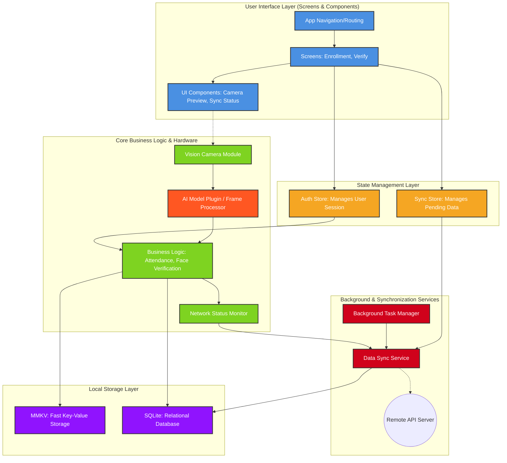

# Application Architecture (Areualive)

This document provides a high-level overview of the Areualive mobile application architecture. It is designed to be easily understood by everyone on the team, regardless of their familiarity with React Native or mobile development.

## High-Level Architecture Diagram

This diagram shows how different parts of the application communicate with each other.

---

# The Core Concept: The "Frame Processor Plugin"

In React Native, the UI runs on a Javascript thread, but the camera hardware runs on a native thread (C++/Java/Objective-C). If we send 30 Frames Per Second (FPS) over a bridge from Native to Javascript to run your AI model, the app will lag and crash.

To solve this, you will be building a **Vision Camera Frame Processor Plugin**. This is essentially a piece of native code (C++/JSI) that intercepts the raw memory buffer of the camera frame before it ever touches Javascript.

---

## The 4 Touchpoints You Need to Update

### 1. The Core Implementation (`lib/cameraInterface.ts`)

This is the **single most important file**. It acts as the strict contract between the mobile UI and your underlying native AI model.

Currently, this file contains two empty functions: `verifyFaceFrame` and `enrollFaceFrame`.

**What you need to do:** You need to implement these as **"worklets"**. In React Native, a worklet is a function that executes synchronously on a background native thread, not the main Javascript event loop.

> **Constraints:** Because it is a worklet running at 30fps, you **cannot** use asynchronous concepts like `async/await`, Promises, or network calls inside these functions. It must be a synchronous execution of your inference model (e.g., TFLite).

**The Inputs & Outputs:**

- **`verifyFaceFrame`** will receive a raw `Frame` object (a pointer to the native memory buffer) and a 1D array of floats representing the user's previously saved face embedding. You must run your model and synchronously return a `FaceVerificationResult` struct (a boolean for match, a confidence float, and liveness states like "blink").
    
- **`enrollFaceFrame`** receives a raw `Frame` and must return a 128-dimensional (or whatever size you dictate) embedding array.
    

---

### 2. Tying it to the Camera Feed (`components/camera/CameraPreview.tsx`)

This file renders the actual camera viewfinder on the screen.

**What you need to do:** Right now, it just renders a raw `<Camera />` component. You need to attach your newly built Frame Processor to it.

**How it works:** You will inject a property into this component called a `frameProcessor`. This tells the camera hardware:

> _"Hey, every time you capture a frame, pass the memory buffer to this specific native function (`verifyFaceFrame`) before rendering it to the screen."_

---

### 3. Wiring up the Enrollment Flow (`app/(auth)/enrollment.tsx`)

This is the UI screen where a new user registers their face for the first time.

**What you need to do:** Currently, when the user taps "Register", it calls a `mockEnrollFace()` function that pretends to take 2 seconds and spits out an array of zeros. You need to **replace this mock call**.

**The Goal:** When the user taps the button, you need to:

1. Capture a single frame from your Frame Processor
2. Pass it to your real `enrollFaceFrame()` function
3. Return the real embedding vector so the mobile app can save it to the local encrypted SQLite database

---

### 4. Wiring up the Verification Flow (`app/verify.tsx`)

This is the UI screen where a user scans their face to log attendance.

**What you need to do:** Similar to enrollment, this currently calls a `mockVerifyFace()` function. You need to replace this so it utilizes the **live data stream**.

**The Goal:** The mobile app will:

1. Grab the user's saved embedding from the local database
2. Feed that embedding, along with the live streaming `Frame` objects, into your `verifyFaceFrame` function
3. Your function will rapidly return results (e.g., _"Confidence 0.4, Liveness failed"_) **30 times a second**
4. The UI will use your fast outputs to draw bounding boxes and prompt the user (e.g., _"Blink now"_)
5. Once your function returns a **high confidence match + confirmed liveness**, the UI will freeze the frame and log the attendance

---

## Summary for the AI Team

| Step                      | Action                                                                                                                                            |
| ------------------------- | ------------------------------------------------------------------------------------------------------------------------------------------------- |
| **Build a Native Plugin** | Compile your model (TFLite/ONNX) to run natively in C++ via a Vision Camera Frame Processor                                                       |
| **Ensure Synchronicity**  | The inference must be synchronous and fast enough to run in a worklet without blocking the camera thread                                          |
| **Swap the Mocks**        | Replace the fake async functions in `lib/cameraInterface.ts` with your real synchronous native bindings, and wire them into the camera components |
|                           |                                                                                                                                                   |

